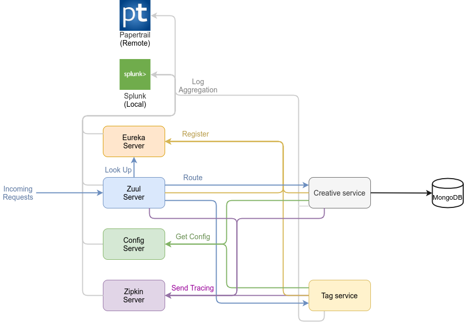

### Ad-Server

This application is responsible for responding to the requests for return 'tag' and the 'creative ad' whenever requested. In v0.1 release, the application should have a this minimum functionality. The architecture looks like shown below.

